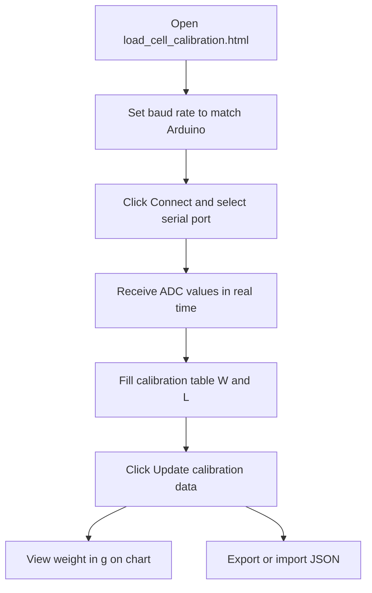

# Strain Gauge Visualizations

**Language / ภาษา:** [English](README.md) · [ภาษาไทย](README.th.md)

Interactive static web app (HTML, CSS, JavaScript) for exploring strain gauge physics, Wheatstone bridge load cells, and Arduino-based weight calibration.


---

## Pages

| Page | File | Description |
|------|------|-------------|
| Strain and Stress | `Strain and Stress.html` | Axial bar model with material selection, force loading, and resistance with temperature compensation |
| Serpentine Gauge | `Strain Gauge.html` | Serpentine metal foil gauge on a steel specimen |
| Load Cell | `load_cells.html` | Full Wheatstone bridge with 4 strain gauges |
| **Load Cell Calibration** | `load_cell_calibration.html` | **Connect Arduino over serial, calibrate, and plot real-time weight** |

Open [index.html](index.html) to choose a visualization.

---

## Load Cell Calibration — User Guide

`load_cell_calibration.html` is the main application for reading live ADC data from an Arduino load cell, applying a moving average, fitting a linear calibration curve, and displaying weight in grams in real time.

### Browser requirements

- Use **Chrome** or **Edge** (requires the [Web Serial API](https://developer.mozilla.org/en-US/docs/Web/API/Web_Serial_API))
- If Web Serial is unavailable, the app shows: *Use Chrome or Edge over http://...*

### Workflow



### 1. Connect Arduino

1. Set **Baud rate** (default 9600) to match `Serial.begin()` on your board.
2. Click **Connect** and select the COM port when prompted.
3. The Arduino must send one numeric ADC value **per line** (e.g. `12345` followed by a newline).
4. Use **Pause / Play** to stop or resume streaming, and **Clear graph** to reset chart data.

Readouts update live:

- **Serial read (string)** — raw line from the port
- **Serial read (number)** — parsed ADC value
- **Sensor value with moving average** — smoothed value used for weight

### 2. Moving average

- Set **Number of average** (0–100, default 10).
- **MA must be greater than 0** for weight to appear.

### 3. Calibration

1. Place a known weight on the load cell.
2. Read the **Moving average** value and enter it in the calibration table as **Sensor value (L, ADC level)**.
3. Enter the actual mass as **True weight (W, g)**.
4. Repeat for up to **4 points** (more spread across your weight range improves the fit).
5. Click **Update calibration data**.
6. The app performs a linear fit and shows:
   - Transfer function equation
   - Inverse transfer function
   - Calibration scatter plot with fit line

All four cells in the table must contain valid numbers before updating.

### 4. Export / Import

- **Export calibration** saves `load-cell-calibration.json` (schema version 1).
- **Import calibration** loads a previously saved JSON file.

Example format (see [calibration-setting-files/load-cell-calibration.json](calibration-setting-files/load-cell-calibration.json)):

```json
{
  "schemaVersion": 1,
  "exportedAt": "2026-06-22T08:57:51.703Z",
  "baudRate": 9600,
  "movingAverage": 10,
  "calibration": [
    { "w": 0, "l": -24531.7 },
    { "w": 63.6, "l": -11145.1 }
  ]
}
```

### 5. Charts

| Chart | Content |
|-------|---------|
| Sensor | Raw ADC and moving average vs time |
| Weight (g) | Computed weight vs time (after calibration) |
| Calibration | Calibration points and linear fit |

Each chart has a collapsible **Graph console** for toggling series, grid, scale, and axis limits.

---

## Tech stack

- Static web: HTML, CSS, vanilla JavaScript (no build step)
- [KaTeX](https://katex.org/) v0.16.9 (vendor) — equation rendering
- [Web Serial API](https://developer.mozilla.org/en-US/docs/Web/API/Web_Serial_API) — Load Cell Calibration page
- Docker + pytest — tests in the `web-app-testing` container

---

## Further reading

See [step-setting.md](step-setting.md) for:

- Creating a GitHub repository
- Configuring GitHub Pages
- Published URL: https://PLS-C.github.io/strain-gauges-visualization/

---

## License

This project is licensed under the [MIT License](LICENSE).
