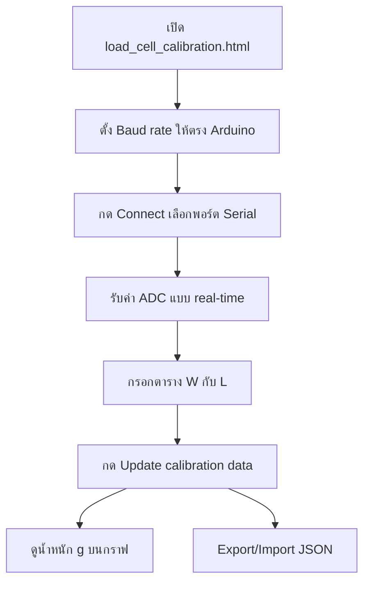

# Strain Gauge Visualizations

**Language / ภาษา:** [English](README.md) · [ภาษาไทย](README.th.md)

เว็บแอป static (HTML, CSS, JavaScript) สำหรับจำลองฟิสิกส์ strain gauge แบบ interactive รวมถึง load cell แบบ Wheatstone bridge และการคาลิเบรตน้ำหนักผ่าน Arduino

---

## หน้าในโปรเจกต์

| หน้า | ไฟล์ | หน้าที่ |
|------|------|---------|
| Strain and Stress | `Strain and Stress.html` | แท่งรับแรง axial เลือกวัสดุ คำนวณความต้านทานพร้อมชดเชยอุณหภูมิ |
| Serpentine Gauge | `Strain Gauge.html` | ฟอยล์ gauge แบบ serpentine บนตัวอย่างเหล็ก |
| Load Cell | `load_cells.html` | Wheatstone bridge แบบเต็ม 4 strain gauge |
| **Load Cell Calibration** | `load_cell_calibration.html` | **เชื่อม Arduino ผ่าน serial คาลิเบรต และแสดงน้ำหนัก real-time** |

เปิด [index.html](index.html) เพื่อเลือก visualization

---

## Load Cell Calibration — คู่มือการใช้งาน

`load_cell_calibration.html` เป็นแอปหลักสำหรับอ่านค่า ADC จาก Arduino load cell แบบ real-time ใช้ค่าเฉลี่ยเคลื่อนที่ (moving average) ทำ linear fit คาลิเบรต และแสดงน้ำหนักเป็นกรัม

### ข้อกำหนดเบราว์เซอร์

- ใช้ **Chrome** หรือ **Edge** (ต้องรองรับ [Web Serial API](https://developer.mozilla.org/en-US/docs/Web/API/Web_Serial_API))
- เปิดผ่าน **HTTPS**
- หาก Web Serial ใช้ไม่ได้ แอปจะแสดงข้อความ: *Use Chrome or Edge over http://...*

### ขั้นตอนการใช้งาน



### 1. เชื่อมต่อ Arduino

1. ตั้ง **Baud rate** (ค่าเริ่มต้น 9600) ให้ตรงกับ `Serial.begin()` บนบอร์ด
2. กด **Connect** แล้วเลือกพอร์ต COM ที่ปรากฏ
3. Arduino ต้องส่งค่า ADC เป็นตัวเลข **หนึ่งค่าต่อบรรทัด** (เช่น `12345` ตามด้วย newline)
4. ใช้ **Pause / Play** หยุด/เริ่มรับข้อมูล และ **Clear graph** ล้างข้อมูลกราฟ

ค่าที่แสดงแบบ real-time:

- **Serial read (string)** — ข้อมูลจาก Arduino
- **Serial read (number)** — ค่า ADC ที่ parse แล้ว
- **Sensor value with moving average** — ค่าเฉลี่ยเคลื่อนที่ที่ใช้คำนวณน้ำหนัก

### 2. Moving average

- ตั้ง **Number of average** (0–100 ค่าเริ่มต้น 10)
- ต้องตั้ง **MA > 0** ถึงจะแสดงน้ำหนักได้

### 3. คาลิเบรต

1. วางน้ำหนักที่รู้ค่าจริงบน load cell
2. อ่านค่า **Moving average** แล้วกรอกในตารางคาลิเบรตที่คอลัมน์ **Sensor value (L, ADC level)**
3. กรอกมวลจริงที่คอลัมน์ **True weight (W, g)**
4. ทำซ้ำได้สูงสุด **4 จุด** (กระจายช่วงน้ำหนักให้กว้างจะได้ fit ดีขึ้น)
5. กด **Update calibration data**
6. ระบบทำ linear fit แล้วแสดง:
   - สมการ transfer function
   - สมการ inverse transfer function
   - กราฟจุดคาลิเบรตพร้อมเส้น fit

ต้องกรอกตัวเลขครบทุกช่องในตารางก่อนกดอัปเดต

### 4. Export / Import

- **Export calibration** บันทึกเป็น `load-cell-calibration.json` (schema version 1)
- **Import calibration** โหลดไฟล์ JSON ที่เคยบันทึกไว้

รูปแบบตัวอย่าง (ดู [calibration-setting-files/load-cell-calibration.json](calibration-setting-files/load-cell-calibration.json)):

```json
{
  "schemaVersion": 1,
  "exportedAt": "2026-06-22T08:57:51.703Z",
  "baudRate": 9600,
  "movingAverage": 10,
  "calibration": [
    { "w": 0, "l": -24531.7 },
    { "w": 63.6, "l": -11145.1 }
  ]
}
```

### 5. กราฟ

| กราฟ | เนื้อหา |
|------|---------|
| Sensor | Raw ADC และ moving average เทียบเวลา |
| Weight (g) | น้ำหนักที่คำนวณได้ เทียบเวลา (หลังคาลิเบรตสำเร็จ) |
| Calibration | จุดคาลิเบรตและเส้น linear fit |

แต่ละกราฟมี **Graph console** สำหรับเปิด/ปิด series, grid, scale และกำหนดขอบเขตแกน

---


## เทคโนโลยีที่ใช้

- Static web: HTML, CSS, vanilla JavaScript (ไม่มี build step)
- [KaTeX](https://katex.org/) v0.16.9 (vendor) — แสดงสมการ
- [Web Serial API](https://developer.mozilla.org/en-US/docs/Web/API/Web_Serial_API) — หน้า Load Cell Calibration

---

## สัญญาอนุญาต

โปรเจกต์นี้อยู่ภายใต้ [MIT License](LICENSE)